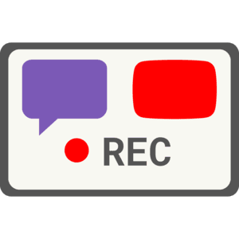
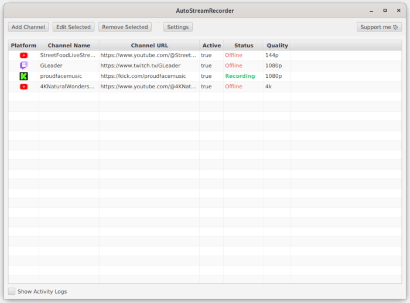

###

<div align="center">



# AutoStreamRecorder

Desktop app to automatically monitor Twitch / YouTube / Kick channels and record livestreams as soon as they go live.

</div>

###

<div align="center">

## ⚠️ Early Development Warning

**This application is currently in early development and has not had its first official release yet.**

While you can build and run the application in its current state, it contains only the basic minimum features for stream monitoring and recording. The functionality works but the user experience is still rough around the edges.

**Use at your own discretion** - expect bugs, missing features, and potential breaking changes.

</div>

###

<div align="center">

  ## Features:

</div>
  
- **Multi-Platform Support**: Monitor Twitch, YouTube and Kick channels simultaneously
- **Automatic Detection**: Start recording immediately when streams go live
- **Custom Quality Settings**: Choose recording quality per channel (best, 1080p, 720p, etc.)
- **Organized Storage**: Recordings are automatically sorted by channel in separate folders
- **Cross-Platform**: Works on Windows and Linux with automatic tool detection

<div align="center">

The application uses Streamlink under the hood for reliable stream capture and supports automatic monitoring with customizable check intervals.



</div>


###

<div align="center">
  
  # Build it yourself

</div>

  For now, the only way for you to run the app is to build it yourself: 

  ### Prerequisites
  - Java 17 or higher
  - Maven 3.6+
  - **Streamlink** installed on your system (7.3.0 or higher for Kick support)

  ### Installation
  ```bash
  # Clone the repository
  git clone https://github.com/YouG-o/AutoStreamRecorder.git
  cd AutoStreamRecorder

  # Build the application
  mvn clean javafx:run
  ```


###

<div align="center">
  
  # Contributors:
  

  Contributions are welcome! Whether you want to fix bugs, add features, or improve documentation, your help is appreciated.

</div>

###

<div align="center">
  
  # Support This Project

</div>  

This application is completely free and open-source. If you find it valuable, you can support its development with a pay-what-you-want contribution!

<br>

<div align="center">

  [](https://ko-fi.com/yougo)
    
  [](https://youtube-no-translation.vercel.app/?donate=crypto)

</div>

<br>

You can also support this project by:

- Starring this repository
- Sharing it with others who might find it useful
- Following me on [GitHub](https://github.com/YouG-o)

###

<div align="center">

# Legal Notice ⚠️

**Important:** Before recording any stream, make sure you have the creator's permission or that the content is not protected by copyright.

Always respect the terms of service of streaming platforms (Twitch, YouTube, etc.).

This software is provided for educational and personal use only. I do not encourage copyright infringement and cannot be held responsible for improper use of this application.


# LICENSE

This project is licensed under the [GNU Affero General Public License v3.0](LICENSE)

</div>