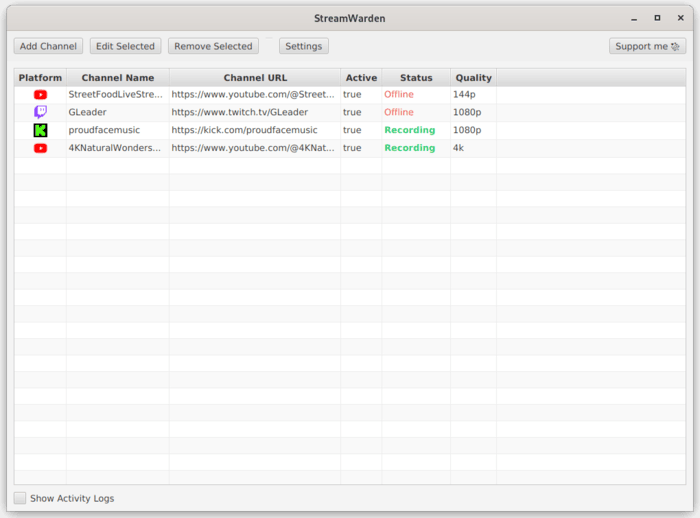

<div align='center'>

  [](https://github.com/YouG-o/StreamWarden/releases/latest)
  [](https://github.com/YouG-o/StreamWarden/stargazers)
  [](https://github.com/YouG-o/StreamWarden/graphs/contributors)
  

</div>

###

<div align="center">


# StreamWarden

Desktop app to monitor Twitch / YouTube / Kick channels and automatically record livestreams as soon as they go live.

</div>

###

<div align="center">

  ## Features:

</div>
  
- **Multi-Platform Support**: Monitor Twitch, YouTube and Kick channels simultaneously
- **Automatic Detection**: Start recording immediately when streams go live
- **Custom Quality Settings**: Choose recording quality per channel (best, 1080p, 720p, etc.)
- **Organized Storage**: Recordings are automatically sorted by channel in separate folders
- **Cross-Platform**: Works on Windows and Linux with automatic tool detection

<div align="center">

The application uses Streamlink under the hood for reliable stream capture and supports automatic monitoring with customizable check intervals.

<div align="center">

  ## Screenshot:

</div>



</div>


###

<div align="center">

## 🚀 Install

</div>

**Windows users:**  
You can download the latest pre-built portable version of StreamWarden directly from the [latest release](https://github.com/YouG-o/StreamWarden/releases/latest).

> **No installation required!**  
> The portable zip contains everything you need:  
> - Java runtime (no need to install Java)
> - Streamlink (no need to install it separately)
> - All required native dependencies  
> Just unzip and run the executable on any recent Windows system.

**Other platforms (Linux, MacOS):**  
You need to build the application yourself.  
See the [Build it yourself](#build-it-yourself) section below for instructions.


###

<div align="center">
  
  ## Build it yourself

</div>

### Clone the repository
```
# Clone the repository
git clone https://github.com/YouG-o/StreamWarden.git
cd StreamWarden
```

### Then choose the method that fits your needs:

---

### 1. Development Build (Cross-platform)

#### Prerequisites
- Java Development Kit (JDK) 22 or higher
- Maven 3.6+
- **Streamlink** installed on your system (7.3.0 or higher for Kick support) (tested on 7.6.0)
- **Python** (required by Streamlink)

#### Installation & Run
```bash
# Build and run the application in development mode
mvn clean javafx:run
```
This will launch the app directly from source.  
You must have Streamlink and Python installed and available in your system PATH.

---

### 2. Windows: Build a Portable Executable

If you are on Windows, you can generate a portable `.exe` version of StreamWarden using the provided batch script:

```bat
build-windows-portable.bat
```

This script will:
- Automatically download and prepare all required native dependencies (Streamlink portable, JavaFX & Maven)
- Build the application with Maven
- Package everything into a portable app-image using jpackage

#### How to use:
1. Make sure you have the Java Development Kit (JDK) 22 or higher.
2. Open a terminal in the project root directory.
3. Run the script
4. After completion, you will find the portable executable in the `StreamWarden_Win_Portable` folder.

---

###

<div align="center">
  
  ## Contributors:

  Contributions are welcome! Whether you want to fix bugs, add features, or improve documentation, your help is appreciated.

</div>

###

<div align="center">
  
  ## Support This Project

</div>  

This application is completely free and open-source. If you find it valuable, you can support its development with a pay-what-you-want contribution!

<br>

<div align="center">

  [](https://ko-fi.com/yougo)
    
  [](https://youtube-no-translation.vercel.app/?donate=crypto)

</div>

<br>

You can also support this project by:

- Starring this repository
- Sharing it with others who might find it useful
- Following me on [GitHub](https://github.com/YouG-o)

###

<div align="center">

## Legal Notice ⚠️

**Important:** Before recording any stream, make sure you have the creator's permission or that the content is not protected by copyright.

Always respect the terms of service of streaming platforms (Twitch, YouTube, etc.).

This software is provided for educational and personal use only. I do not encourage copyright infringement and cannot be held responsible for improper use of this application.


## LICENSE

This project is licensed under the [GNU Affero General Public License v3.0](LICENSE)

</div>